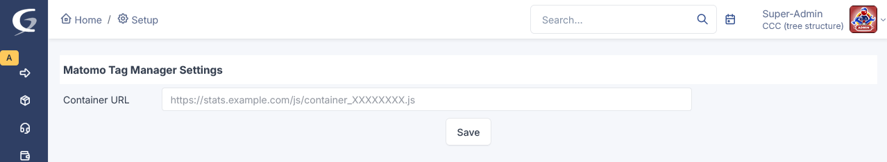
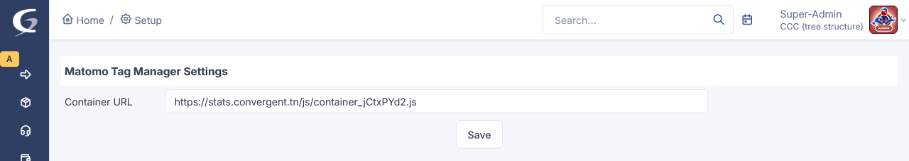

# Matomo Tag Manager — inject a Matomo container into every GLPI page

Inject a [Matomo Tag Manager](https://matomo.org/guide/tag-manager/) container into every GLPI page with zero code changes — just paste your container URL in the plugin settings. The container script is then loaded on all pages (authenticated screens and the login screen), enabling visitor tracking, event collection and tag management through your Matomo dashboard.

## Features

- Loads your Matomo Tag Manager container on **every** GLPI page (authenticated pages and the login screen)
- Container URL configured entirely from the GLPI admin panel — no file or template editing
- Injected via the native `$PLUGIN_HOOKS` header hook + one small static JS loader; asynchronous, zero perceptible overhead
- No custom database table — the single setting is stored in GLPI's own configuration store
- French + English interface

## Requirements

| Requirement | Version |
|-------------|---------|
| GLPI        | 10.x or 11.x (`~10.0.0`) |
| PHP         | ≥ 8.1 |
| Matomo      | A reachable Matomo Tag Manager container URL |

## Installation

1. Download the latest release archive from the [Releases](https://github.com/FathiBenNasr/glpi-matomo/releases) page (or install it from git with the **Git Plugin Installer** plugin).
2. Extract into your GLPI `plugins/` directory so the path is `plugins/matomo/`.
3. Install & enable as the web user, or via the UI (**Setup → Plugins → Matomo Tag Manager → Install → Enable**):
   ```bash
   sudo -u apache php bin/console plugin:install matomo
   sudo -u apache php bin/console plugin:activate matomo
   sudo -u apache php bin/console cache:clear
   ```

## Usage

1. Go to **Setup → Matomo Tag Manager**.
2. Paste your Matomo Tag Manager **Container URL** (e.g. `https://stats.example.com/js/container_XXXXXXXX.js`).
3. Click **Save** — the container is injected on the next page load and tracking starts immediately.

## Configuration

| Setting | Description |
|---------|-------------|
| Container URL | Full HTTPS URL to your MTM container JS (`https://…/js/container_XXXXXXXX.js`). Must start with `https://`. |

The value is stored in GLPI's core configuration store under the `plugin:matomo` context (no dedicated plugin table is created).

## Permissions

Configuration requires the GLPI core **`config: UPDATE`** right (typically the full-administrator profile) — the same right that protects GLPI's general setup. The plugin registers **no custom right** and writes only to GLPI's configuration store.

## Architecture

- On every request, the plugin's `$PLUGIN_HOOKS` header hook outputs a `<script>` tag pointing at a tiny static loader (`public/js/mtm-loader.js` / `mtm-config.js`), which in turn loads your configured Matomo container URL.
- The container URL is read from GLPI's core config (`Config::getConfigurationValues('plugin:matomo', ['container_url'])`) — no plugin database table, no per-asset data.
- The plugin is `csrf_compliant`; the configuration form posts through GLPI's CSRF-protected front controller.

## Security

- The container URL is validated to start with `https://` before being saved.
- Output is escaped (`htmlspecialchars`, `ENT_QUOTES`) when rendered into the page.
- The configuration page is gated by `config: UPDATE` and protected by GLPI 11's CSRF listener.
- The plugin reads/writes only GLPI's own configuration store — it touches no core or third-party tables.

## Screenshots

Configuration page — before and after pasting the container URL:





## Changelog

See [CHANGELOG.md](CHANGELOG.md).

## Support

Report bugs and request features on the [issue tracker](https://github.com/FathiBenNasr/glpi-matomo/issues).

## License

Distributed under the [GNU GPL v2.0-or-later](LICENSE) license.

---

<div align="center">

## Developed by

[](https://www.convergent.tn)

**[Convergent Cloud Computing](https://www.convergent.tn)**  
Cloud infrastructure, open-source integration, and cybersecurity solutions for Tunisian and international businesses.

📧 contact@convergent.tn | 🌐 [www.convergent.tn](https://www.convergent.tn)

</div>
