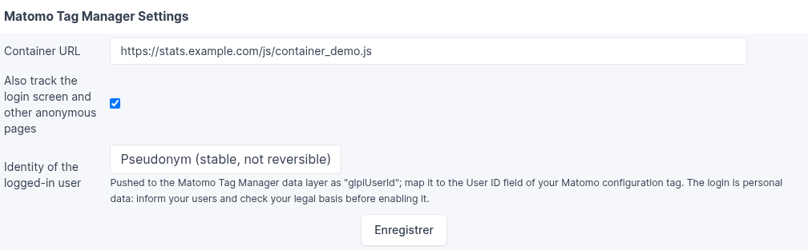

# Matomo Tag Manager — inject a Matomo container into GLPI pages



Inject a [Matomo Tag Manager](https://matomo.org/guide/tag-manager/) container into GLPI with zero code changes — just paste your container URL in the plugin settings. The container is loaded on every page shown to a logged-in user (standard and simplified interfaces) and, unless you switch it off, on the login screen and the other anonymous pages. It can optionally tell Matomo **who** the logged-in user is.

## Features

- Loads your Matomo Tag Manager container on every page shown to a logged-in user, and on the login screen (switchable)
- **Optional user identity** pushed to the MTM data layer as `glpiUserId`: a non-reversible pseudonym, or the GLPI login (see *Privacy*)
- Configured entirely from the GLPI admin panel — no file or template editing
- Native GLPI plugin hooks + one small static JS loader; asynchronous, zero perceptible overhead
- No custom database table — settings live in GLPI's own configuration store

## Requirements

| Requirement | Version |
|-------------|---------|
| GLPI        | 11.x → plugin 1.0.x · 12.x → plugin 1.1.x · 10.x → plugin 1.0.0 (login screen and identity not available) |
| PHP         | ≥ 8.2 |
| Matomo      | A reachable Matomo Tag Manager container URL |

## Installation

1. Download the latest release archive from the [Releases](https://github.com/FathiBenNasr/glpi-matomo/releases) page (or install it from git with the **Git Plugin Installer** plugin).
2. Extract into your GLPI `plugins/` directory so the path is `plugins/matomo/`.
3. Install & enable as the web user, or via the UI (**Setup → Plugins → Matomo Tag Manager → Install → Enable**):
   ```bash
   sudo -u apache php bin/console plugin:install matomo
   sudo -u apache php bin/console plugin:activate matomo
   sudo -u apache php bin/console cache:clear
   ```

## Usage

1. Go to **Setup → Matomo Tag Manager**.
2. Paste your Matomo Tag Manager **Container URL** (e.g. `https://stats.example.com/js/container_XXXXXXXX.js`).
3. Choose whether to track the login screen, and which **identity** to send (default: none).
4. Click **Save** — the container is injected on the next page load and tracking starts immediately.

To use the identity in Matomo: in Tag Manager, create a *Data-Layer* variable named `glpiUserId`, then set it as the **User ID** of your *Matomo Configuration* variable.

## Configuration

| Setting | Description |
|---------|-------------|
| Container URL | Full HTTPS URL to your MTM container JS (`https://…/js/container_XXXXXXXX.js`). Must start with `https://`. Empty = tracking off. |
| Track the login screen | Also load the container on anonymous pages (login, password reset). On by default. No identity is ever sent there. |
| Identity of the logged-in user | **Do not send** (default) · **Pseudonym** — HMAC-SHA256 of the GLPI user id keyed with the instance's GLPI key: stable, not reversible, meaningless outside your instance · **GLPI login** — in clear. |

The value is stored in GLPI's core configuration store under the `plugin:matomo` context (no dedicated plugin table is created).

## Privacy

Sending an identity to Matomo links every visit to a person: under the GDPR (and the Tunisian law 2004-63) the **pseudonym is still personal data**, the login even more so. Before enabling either: have a legal basis, inform your users (and update your privacy notice), keep Matomo self-hosted if you can, and prefer the pseudonym. The identity is never sent on anonymous pages, and the setting fails closed: without a GLPI key no pseudonym is produced, and there is never a fallback to the login.

## Permissions

Configuration requires the GLPI core **`config: UPDATE`** right (typically the full-administrator profile) — the same right that protects GLPI's general setup. The plugin registers **no custom right** and writes only to GLPI's configuration store.

## Architecture

- The plugin passes its settings as `<meta>` tags through GLPI's `add_header_tag` / `add_header_tag_anonymous_page` hooks (escaped by GLPI's template), and loads one static script, `public/js/mtm-loader.js`, through `add_javascript` / `add_javascript_anonymous_page`. The loader reads the tags, pushes `glpiUserId` when present, then starts MTM.
- Settings are read from GLPI's core config (`plugin:matomo` context: `container_url`, `track_anonymous`, `user_id_mode`) — no plugin database table, no per-asset data, and no file written at runtime.
- The plugin is `csrf_compliant`; the configuration form posts through GLPI's CSRF-protected front controller.

## Security

- The container URL is validated to start with `https://` before being saved.
- Settings reach the page as data only: escaped `<meta>` attributes, never JavaScript; the loader refuses a container that is not `https://`.
- The identity mode is whitelisted; an unknown stored value falls back to *Do not send*.
- The configuration page is gated by `config: UPDATE` and protected by GLPI 11's CSRF listener.
- The plugin reads/writes only GLPI's own configuration store — it touches no core or third-party tables.

## Screenshots

Generated by the browser bench, see [docs/captures/](docs/captures/README.md).

## Tests

```bash
php tests/run.php            # or: phpunit --no-configuration tests/
node --test tests/*.test.js  # the real loader, in a vm sandbox
```

## Changelog

See [CHANGELOG.md](CHANGELOG.md).

## Support

Report bugs and request features on the [issue tracker](https://github.com/FathiBenNasr/glpi-matomo/issues).

## License

Distributed under the [GNU GPL v2.0-or-later](LICENSE) license.

---

<div align="center">

## Developed by

[](https://www.convergent.tn)

**[Convergent Cloud Computing](https://www.convergent.tn)**  
Cloud infrastructure, open-source integration, and cybersecurity solutions for Tunisian and international businesses.

📧 contact@convergent.tn | 🌐 [www.convergent.tn](https://www.convergent.tn)

</div>
